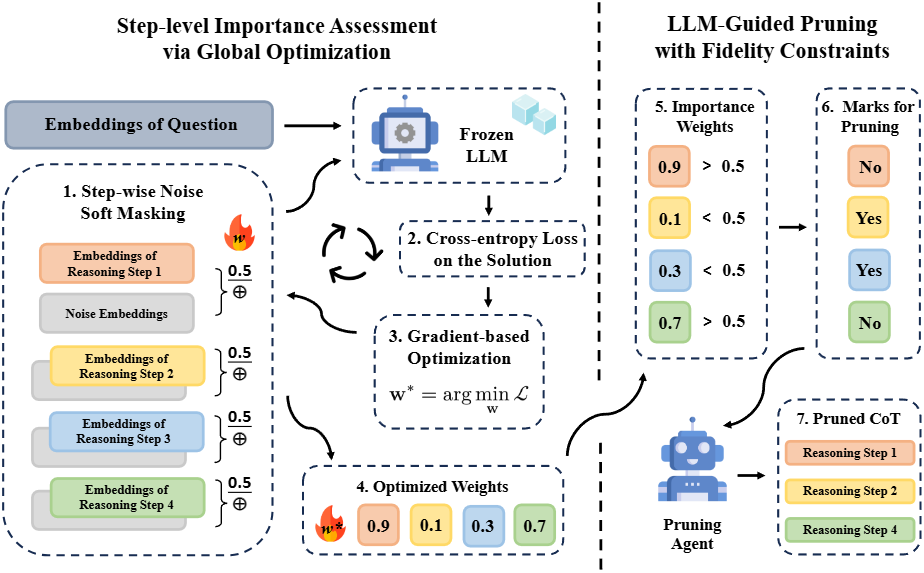

# Pru-CoT: Towards Efficient Reasoning Distillation via Pruning Chain-of-Thought

<div align="center">  <p><em>Figure: Overview of the Pru-CoT framework.</em></p> </div>

## Environment Setup

Create and activate the conda environment:

```bash
conda create -n Pru-CoT python=3.10
conda activate Pru-CoT
```

Install dependencies:

```bash
pip install -r requirements.txt
conda install -c conda-forge cuda-toolkit=12.4 -y
pip install flash-attn==2.7.2.post1 --no-build-isolation
```

## Step-level Importance Assessment via Global Optimization

The cot_weight.py script performs step-level importance assessment using global optimization techniques.

```bash
accelerate launch --main_process_port 0 cot_weight.py \
    --model_path $MODEL_PATH \
    --dataset_path $DATASET_PATH \
    --dataset_processed_path $DATASET_PROCESSED_PATH \
    --dataset_name $DATASET_NAME \
    --max_length 8192 \
    --epochs 3 \
    --type "noise" \
    --init_v 0.5 \
    --optimizer "SGD" \
    --lr 10 \
    --rate 1.0
```

## LLM-Guided Pruning with Fidelity Constraints

The LLM_prune_threshold.py script implements LLM-guided pruning with fidelity constraints.

```bash
python LLM_prune_threshold.py \
    --dataset_path $DATASET_PATH \
    --output_path $OUTPUT_PATH \
    --dataset_name $WEIGHTED_DATASET_NAME \
    --LLM_path $LLM_PATH \
    --temperature 0.9 \
    --top_p 0.95 \
    --max_tokens 8192 \
    --tensor_parallel_size $SIZE \
    --rate 1.0 \
    --candidate_threshold 0.5
```